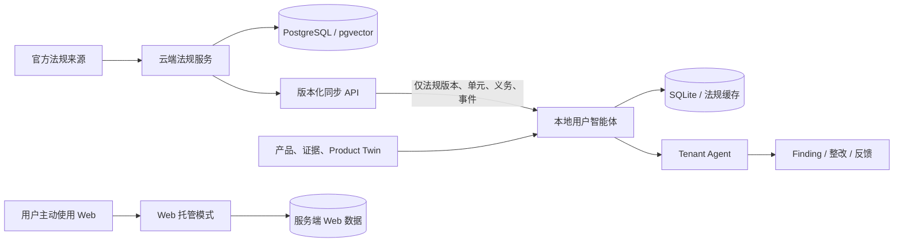

# 云端法规服务与本地用户智能体架构

本文定义云端法规服务、本地用户智能体和现有 Web 托管模式的运行职责。后续拆分以本文件为准；不通过移动目录来替代数据边界和通信边界。

## 三种运行模式

| 模式 | 运行位置 | 数据库 | 负责内容 | 禁止内容 |
| --- | --- | --- | --- | --- |
| 云端法规服务 | 受控云端环境 | PostgreSQL + pgvector | 官方来源、法规、版本、Legal Unit、Requirement、法规变化事件、法规检索与增量同步 API | 读取 Company、Product Twin、私有文档/仓库证据、Finding、整改、反馈；执行租户分析 |
| 本地用户智能体 | 用户设备回环服务 | 用户应用数据目录中的 SQLite 与法规缓存 | Company/Product、Product Twin、私有证据、Tenant Agent、Finding、整改、反馈和运行记录；通过 HTTPS API 拉取法规 | 连接云端数据库；默认上传私有上下文；默认调用外部 LLM；运行官方法规抓取器 |
| Web 托管模式 | 云端 Web 应用 | 服务端数据库 | 用户主动提交的评估流程、身份和租户授权，以及既有 Web API | 冒充本地模式或宣称私有本地数据已同步 |

## 调用关系与数据流

本地同步请求只携带同步协议所需的游标、分页和法规筛选条件。它不携带产品事实、私有证据、Finding、整改或反馈。法规事件只描述法规变更，不包含任何企业影响或整改结论。

## 模块复用与边界

- `app.regintel` 保留现有抓取、规范化、版本、义务提取、检索和事件能力，云端模式只装载这些路由与调度器。
- `app.tenant`、`app.understanding` 和现有 Product Twin、Finding、Remediation、Feedback 领域逻辑保留，由本地与 Web 模式复用。
- 阶段三会以法规网关替换 Tenant Agent 对共享 `SessionLocal` 的直接假设。本地网关从 SQLite 缓存读取；云端 API 是缓存的唯一上游。
- Web 托管模式保留现有身份、租户授权和业务接口。用户主动发送到 Web 的内容属于 Web 托管数据，不能被表述为桌面默认本地数据。

## 同步契约原则

- 协议版本化；首次同步和增量同步使用同一资源模型。
- 游标按稳定的事件序号和事件标识排序，不以时间戳单独排序。
- 跨端关系使用不可变的法规外部标识和版本标识，不使用云端自增主键作为本地业务主键。
- 本地只有在版本、Legal Unit、Requirement 与事件引用完整写入后才能推进游标；重复请求必须幂等。
- 网络不可用时继续使用已有缓存和既有分析结果，并明确暴露缓存状态。

## 当前限制和后续阶段

当前 `main` 的 RegIntel 与 Tenant Agent 共享同一数据库会话，尚未形成同步闭环。阶段二会建立模式入口和隔离初始化；阶段三实现 HTTP 同步、缓存与法规网关；阶段四才根据真实依赖整理构建、部署和工作流。
