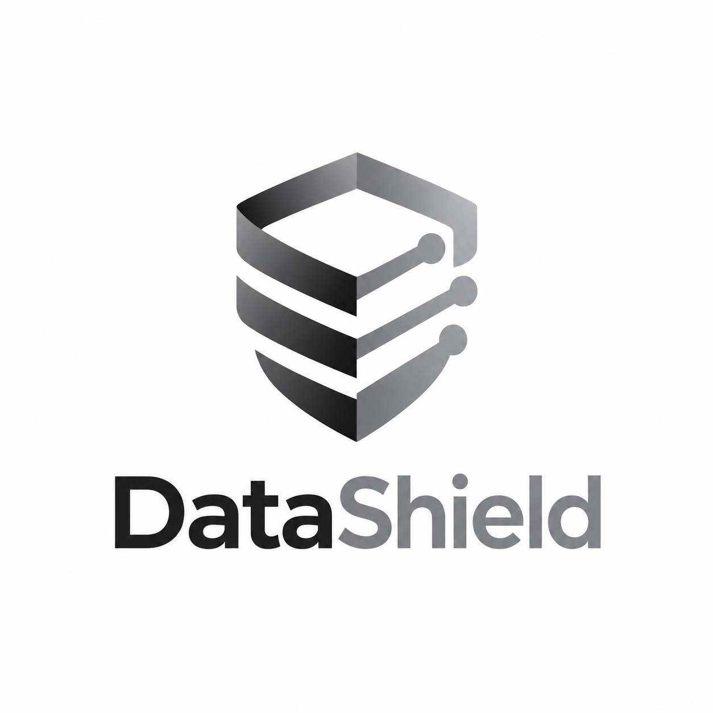
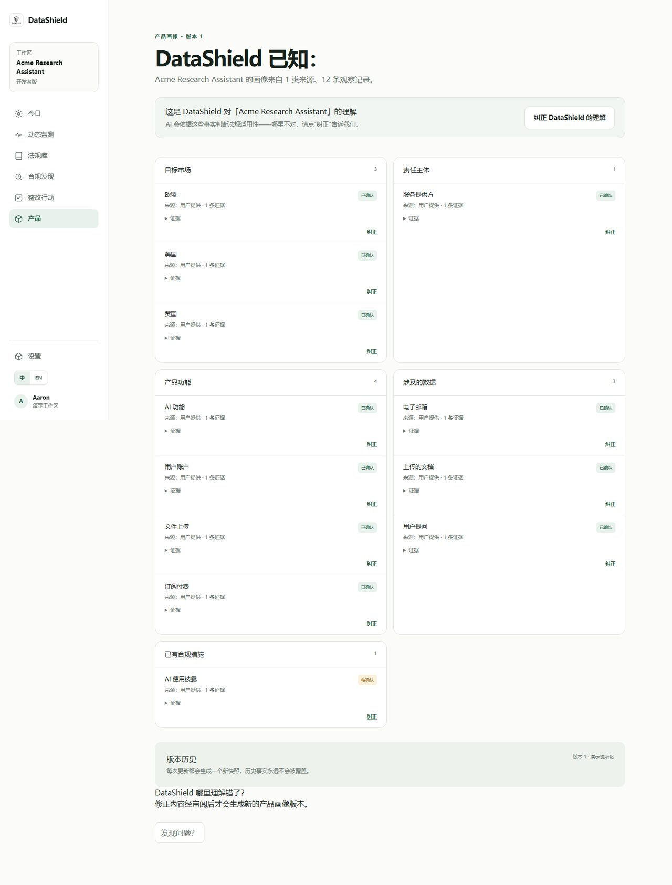
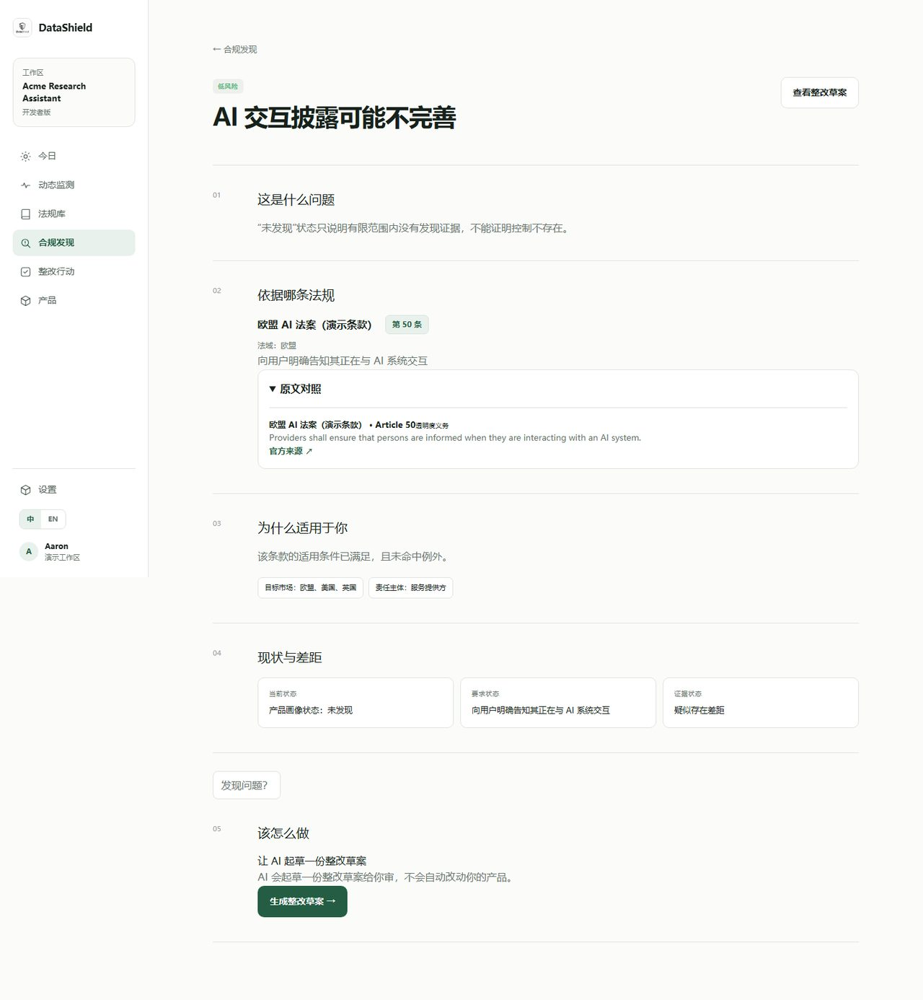
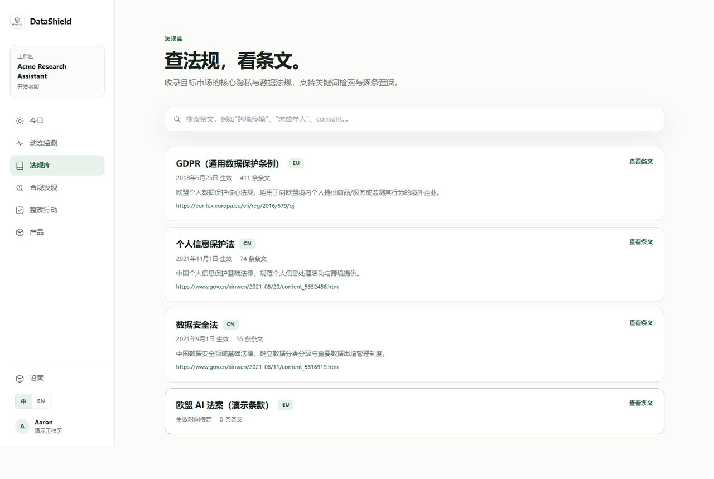
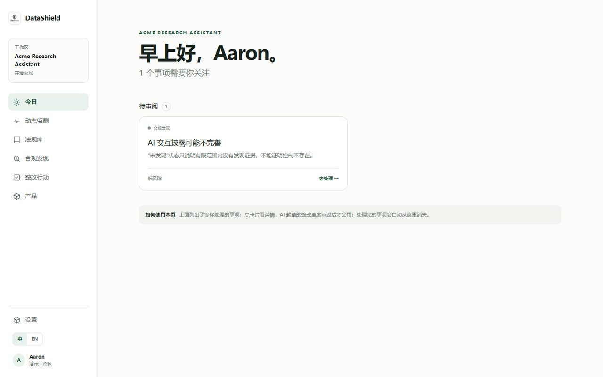

# DataShield 数盾 · 产品说明书



**说说你的产品是做什么的，AI 告诉你触犯哪些法规、怎么改。**

中文优先的 AI 合规助手：支持 GDPR、《个人信息保护法》《数据安全法》，DeepSeek 大模型驱动。

| 项目 | 内容 |
| --- | --- |
| 产品名称 | DataShield 数盾 |
| 版本 | V0.1.0 |
| 发布日期 | 2026-10-08 |
| 适用对象 | 中国出海企业、出海产品开发者、企业合规负责人 |

> 本工具输出仅供合规工作参考，不构成法律意见。

---

## 一、产品背景与目标用户

### 1.1 为什么需要 DataShield

做一款要出海的产品，数据合规是绕不过去的坎：

- **法规多、看不懂。** GDPR 上百条英文条文，加上《个人信息保护法》《数据安全法》，条款之间还有交叉，非法律背景的开发者根本不知道该看哪几条。
- **请律师贵、周期长。** 一次合规咨询动辄数千到数万元，对初创团队和个人开发者是难以承受的成本；等意见下来，产品可能已经上线跑了几个月。
- **改了还会变。** 法规持续修订，今天合规不代表明天合规，靠人工盯官方公告几乎不可能。
- **不知道自己不知道什么。** 很多团队不是"明知不合规"，而是压根没意识到某个功能（比如 AI 对话、文件上传）已经触发了法定义务。

DataShield 要解决的，就是让一个**不懂合规的中文用户**，用日常语言描述自己的产品，10 分钟内拿到一份"哪里可能不合规、依据哪条法规、该怎么改"的清单，并且全程中文、每一步都由人审阅决定。

### 1.2 目标用户画像

| 用户类型 | 典型场景 | DataShield 的价值 |
| --- | --- | --- |
| 出海产品开发者 / 独立开发者 | 产品要面向欧盟、东南亚用户，没预算请律师 | 免注册即可体验完整流程，先知道"雷区"在哪 |
| 初创与小微团队 | 产品迭代快，每次加新功能都可能引入新义务 | 改完跑一次自查，确认修正是否生效 |
| 企业合规 / 法务负责人 | 要同时管多个产品，持续跟踪法规变化 | 团队工作区、法规监测、整改审批流，把合规变成可持续的日常流程 |
| 参赛评审 / 潜在企业用户 | 想快速判断产品能力边界 | Demo 版本打开即用，内置示例数据，7 天后自动过期 |

**操作建议**：如果你只是想看看效果，直接用 Demo 版（免注册）；如果你的产品已经上线或准备上线，注册 Developer 版建立自己产品的长期档案。

---

## 二、核心功能

工作台左侧导航对应六大功能：**今日、动态监测、法规库、合规发现、整改行动、产品**。下面按使用顺序逐一说明：每个功能是什么、怎么用、解决什么问题。

### 2.1 产品理解：先让 AI 搞清楚你的产品是干什么的



- **是什么**：DataShield 的一切判断都建立在"产品画像"上——一组关于你产品的事实（目标市场、产品功能、处理的数据、责任主体、已有合规措施等），每条事实都标注状态（已确认 / 已推断 / 未知 / 未检测到）和证据来源。
- **怎么用**：首次进入时三选一——**贴网址**（AI 分析公开产品页面）、**指向本地代码仓库**（识别框架与数据处理线索）、或**手动描述**（用中文填写简介、目标市场、产品能力、处理的数据，约 2 分钟）。生成画像后请逐条核对，发现理解错了点"纠正"，修正经审阅后生成新的画像版本，历史版本永不覆盖。
- **解决什么问题**：合规结论靠不靠谱，取决于对产品理解得准不准。DataShield 坚持"**未知不等于不合规**"——信息不足时会明确标注"未知"，绝不会把没查到的东西当成违规结论，也不会当成已合规。

**操作建议**：画像里"待确认"状态的事实优先核对；产品加了新功能（比如新接入支付、新增 AI 生成）后，记得回来更新画像再重新分析。

### 2.2 合规发现：四段式讲清楚"问题在哪、依据是什么"



- **是什么**：基于已确认的产品画像，对照适用法规逐项检查，产出按风险等级（低 / 中 / 高 / 严重）排序的合规发现清单。每条发现用**四段式**展开：
  1. **这是什么问题**——用大白话说明差距所在；
  2. **依据哪条法规**——具体到法规名称和第几条，附原文对照与官方来源链接；
  3. **为什么适用于你**——列出命中该条款适用条件的产品事实（如目标市场、责任主体）；
  4. **现状与差距**——并排展示"当前状态 / 要求状态 / 证据状态"。
- **怎么用**：完成产品设置后运行初始审查；之后可随时在工作区内重新运行自查。点击任意发现进入详情页，逐段阅读四段式说明。
- **解决什么问题**：把"你可能违反了 GDPR"这种让人无从下手的结论，拆解成"哪个问题、违反哪一条、为什么这条管你、你现在差在哪"——每一条都看得懂、查得到源头。证据状态区分"确认存在差距 / 疑似存在差距 / 信息不足"，不冤枉一个没问题的产品。

**操作建议**：优先处理"严重风险"和"高风险"发现；对"疑似存在差距"的发现，先补充产品信息再下结论。

### 2.3 整改行动：AI 起草草案，你审过才算数

- **是什么**：针对每条合规发现，AI（DeepSeek 大模型，约 1-2 分钟）起草一份整改草案，可能是**文档修改草案**（如隐私政策里要补的一段话）或**代码修改说明**（如需要加的用户提示）。草案包含：问题描述、要求达到的状态、需要修改的地方、实施说明、验收标准（怎么算改好了）。
- **怎么用**：在合规发现详情页点"生成整改草案"，草稿生成后到"整改行动"页打开审阅，逐条核对后选择**采纳**或**拒绝**；代码修改说明支持一键复制。
- **解决什么问题**：很多团队不是不想改，是不知道改成什么样才算合规。草案把"法条要求"翻译成"具体要改的内容和验收标准"，把整改从"研究课题"变成"审阅任务"。

> **重要边界**：草案只是建议。**采纳不会自动修改你的产品，也不会关闭对应的合规发现**——DataShield 没有"自动修复代码"这类功能，每一步都由你审阅、你决定、你执行。

**操作建议**：采纳草案后按验收标准自行修改产品，然后回到工作区重新运行自查，确认差距真正消除。

### 2.4 法规库：GDPR、个保法、数安法全文随手查



- **是什么**：内置三部核心法规的结构化全文——GDPR（通用数据保护条例，411 条条文，2018 年 5 月 25 日生效）、《个人信息保护法》（74 条条文，2021 年 11 月 1 日生效）、《数据安全法》（55 条条文，2021 年 9 月 1 日生效），每条附官方来源链接。
- **怎么用**：顶部搜索框输入关键词（支持中英文，如"跨境传输""未成年人""consent"）做语义检索，命中结果直接定位到条文；也可以点"查看条文"展开某部法规逐条通读。
- **解决什么问题**：合规发现里引用的每一条依据，都能在法规库里翻到原文核对——AI 的结论不是黑箱，你随时可以向源头求证。

**操作建议**：看到合规发现里引用某条款时，先点"原文对照"，再到法规库搜上下文相关条款，建立自己的判断。

### 2.5 动态监测：法规变了，你第一时间知道

- **是什么**：持续跟踪官方来源的法规变化，按类型标注——新增条文、条文修改、条文废止、条文重新编号，每条变化附官方来源链接。
- **怎么用**：打开"动态监测"页查看已核实的法规变化列表；针对你的产品运行法规影响分析，判断该变化与你的产品能力、数据处理和目标市场是否有交集、影响有多大。
- **解决什么问题**：合规不是一次性检查。DataShield 坚持"**相关性不默认假定**"——全球范围的法规变化只有经过针对你产品的分析，才会标记为与你相关，避免被无关变化淹没。

**操作建议**：把"动态监测"设为每周固定查看的页面；对标记为相关的变化，及时重新运行自查。

### 2.6 今日工作台：每天打开就知道该干什么



- **是什么**：把所有待办聚合成一屏：待处理的合规发现、待补充的产品信息、待审阅的整改草案、待确认的画像事实，按"待审阅 / 等待你处理 / 最近完成"分组，标注风险等级。
- **怎么用**：每天从"今日"页开始——点卡片直达详情处理，处理完的事项自动从列表消失；全部清零时页面会明确告诉你"全部处理完毕"。新用户还能在页内看到三步使用指南。
- **解决什么问题**：合规工作最怕"不知道还有哪些没做"。今日页把分散在各功能里的待办汇成一张清单，让合规变成每天几分钟的日常动作。

**操作建议**：把今日页当作入口：先看待办数量，再按风险等级从高到低处理。

---

## 三、三大版本

| 能力 | Demo（免注册体验） | Developer（个人 / 小微团队） | Enterprise（团队） |
| --- | --- | --- | --- |
| 注册要求 | 无需注册，打开即用 | 自助注册，几分钟完成产品设置 | 联系开通 |
| 合规自查 | ✓ | ✓ | ✓ |
| 法规检索 | ✓ | ✓ | ✓ |
| 法规影响分析 | ✓ | ✓ | ✓ |
| 数据保留 | 7 天（演示数据自动过期） | 长期 | 长期 |
| 团队工作区与多产品管理 | — | — | ✓ |
| 法规监控 | — | — | ✓ |
| 整改路线图与人工审批流 | — | — | ✓ |
| 优先支持与开通协助 | — | — | ✓ |

- **Demo**：内置示例产品与法规数据，适合快速体验完整流程、评估产品能力。
- **Developer**：覆盖核心合规场景——合规自查、发现管理、法规检索，适合个人开发者和小微团队长期使用。
- **Enterprise**：面向组织的持续合规工作区，增加团队协作、多产品管理、法规监控与整改审批流。

**操作建议**：先 Demo 体验 → 注册 Developer 建立自己产品的档案 → 团队规模扩大或有持续监控需求时升级 Enterprise。

---

## 四、技术架构

```text
React + Vite + TypeScript 前端（react-i18next 全站中英双语）
        │
        ▼
FastAPI 后端 ── 确定性规则引擎（问卷、评分、报告）
        │
        ├── 账户认证（邮箱+密码，PBKDF2 哈希，HttpOnly 会话）
        ├── LangGraph Agent（影响判断、证据验证、行动规划）
        ├── RAG 法规检索（法规切片、Embedding、Top-K 检索）
        └── SQLite（默认）/ PostgreSQL + pgvector（切换 DATABASE_URL 即可）

AI 能力：DeepSeek 大模型（OpenAI 兼容接口接入；线上部署使用 deepseek-flash（DeepSeek-V4.1-Flash），模型可通过 `LLM_MODEL` 环境变量切换）
桌面版：Electron 壳内嵌 PyInstaller 打包后端（用户无需安装 Python）
```

架构设计要点：

- **AI + 确定性规则双引擎**：法条适用判断、评分等容不得幻觉的环节由确定性规则引擎完成；理解、起草、检索增强由大模型负责，两者各尽其用。
- **中英双语**：基于 react-i18next，Landing 顶栏与工作台侧边栏均有语言切换器，方便涉外团队协作。
- **数据库可平滑升级**：默认 SQLite 零依赖起步，生产环境改一个 `DATABASE_URL` 即切换 PostgreSQL + pgvector 向量检索。
- **桌面版本地防护**：后端只绑定 `127.0.0.1`；每次启动由 Electron 生成随机 runtime token，所有 `/api/*` 请求必须携带，防止同机其他进程或网页盗用本地 API；启动时自动执行 alembic 数据库迁移，迁移前自动备份（保留最近 3 份），失败自动回滚并记录日志。

---

## 五、三种使用方式与操作指南

### 5.1 网页版

1. 浏览器访问 **http://123.57.252.25**（线上地址）。
2. 首页可点"看看演示结果"免注册进入 Demo 工作区，或点"免费开始检查"注册 Developer 账户（邮箱 + 密码，密码至少 8 位）。
3. 按引导完成产品设置，即可使用全部对应版本功能。

**适合**：快速体验、团队协作、随时随地访问。

### 5.2 Windows 桌面版

1. 运行安装包 `DataShield Setup 0.1.0.exe`（约 193MB，NSIS 安装包，内嵌后端，**无需安装 Python 或任何运行时**）。
2. 安装完成后双击桌面图标即用，界面与网页版一致。
3. 所有数据（SQLite 数据库、日志、法规缓存）集中存储在 **`%APPDATA%\DataShield`**；旧版目录数据首次启动自动迁移。

**适合**：数据不出本机的场景、内网环境、对数据主权要求高的用户。桌面版完全本地运行，离线可用（AI 起草功能需联网调用大模型接口）。

### 5.3 管理后台（面向运营 / 管理员）

- 入口：`/admin`，使用管理员密钥（服务端环境变量 `ADMIN_API_KEY`）登录；未配置密钥时管理接口全部关闭（返回 503），密钥不下发到普通用户。
- 功能概述：
  - **总览统计**：用户、工作区、分析活动整体情况；
  - **用户管理**：禁用 / 启用账户（禁用即吊销会话）、重置密码；
  - **企业工作区浏览**：查看各工作区配置与使用情况；
  - **法规库重置**：一键恢复三部预置法规的初始状态；
  - **清空演示数据**：重置 Demo 演示环境。

**适合**：线上服务的运营维护与演示环境管理。

---

## 六、数据安全与隐私说明

我们做合规工具，首先把自己的数据规矩讲清楚：

- **你的数据只存在你的工作区。** 产品信息、分析结果、整改草案都保存在你的账户（本机工作区）下，不会分享给其他用户。
- **桌面版完全本地运行。** 后端只监听 `127.0.0.1`，数据落在 `%APPDATA%\DataShield`，配合每次启动随机生成的 runtime token，同机其他进程和网页无法盗用本地 API。
- **AI 调用最小化传输。** 调用 DeepSeek 大模型时，仅传输完成该任务所必需的产品描述信息（如产品能力、处理的数据类型等画像事实），不传输你的账户凭据、不传输与判断无关的数据。
- **账户安全。** 密码以 PBKDF2-HMAC-SHA256 哈希入库，绝不保存明文；会话使用 HttpOnly cookie，前端脚本无法读取。
- **桌面版升级有兜底。** 每次自动迁移数据库前先备份（保留最近 3 份），迁移失败自动回滚。

---

## 七、免责声明

- DataShield 的所有输出（合规发现、整改草案、影响分析等）**仅供合规工作参考，不构成法律意见**。如需法律建议，请咨询专业律师。
- 预置法规条文用于演示与参考，正式合规决策前请以官方发布的法规文本为准（条文旁均附官方来源链接）。
- 合规结论基于你提供的产品画像信息，信息不完整或不准确会影响结论可靠性——请保持画像更新。

---

## 八、快速上手：五步跑通完整流程

```text
① 注册 / 进入 Demo        ② 描述你的产品          ③ 查看合规发现
   打开网页版或桌面版   →   贴网址 / 指向仓库 /  →   四段式读懂每个问题：
   免注册也能体验           手动描述，确认 AI 画像     什么问题、依据哪条、
                                                     为什么适用、差距在哪
        ┌──────────────────────────────────────────────┘
        ▼
⑤ 持续监控              ④ 审阅整改草案
   今日页看待办清零  ←   AI 起草、你来审：
   动态监测盯法规变化     采纳或拒绝，绝不自动改
```

1. **注册**：访问 http://123.57.252.25 ，点"免费开始检查"用邮箱注册（或点"看看演示结果"免注册进 Demo）。
2. **描述产品**：选择贴网址、指向本地仓库或手动描述，约 2 分钟；核对 AI 生成的产品画像，错的地方点"纠正"。
3. **看合规发现**：运行初始审查，按风险等级从高到低阅读每条发现的四段式说明。
4. **审整改草案**：对要处理的问题点"生成整改草案"，在"整改行动"页审阅后采纳或拒绝，照草案和验收标准修改你的产品。
5. **持续监控**：每天看"今日"页待办，每周看"动态监测"法规变化，产品有大改动后重新运行自查。

全程中文，跟着提示走就行——不用懂合规，也能把合规做起来。
